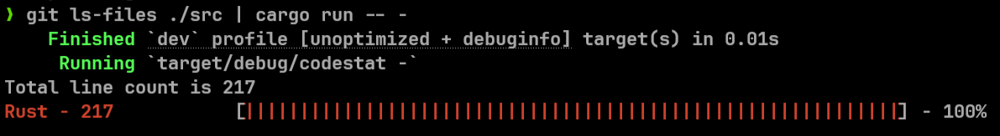
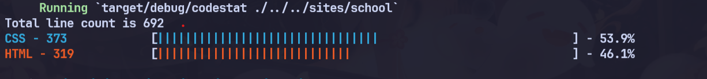

## codestat
A command line utility to view the most used programming languages in a project. Languages are decided using file extensions and usage is currently counted by line count.

;

### Usage
It is recommended to use this tool with ```git ls-files``` like this.
```bash
git ls-files | codestat
```

```bash
# It crawls the directory at path or accepts a piped list of files if path is '-'
./codestat [PATH]
```


### Instalation
1. Build from source ;)
2. Run the program.

